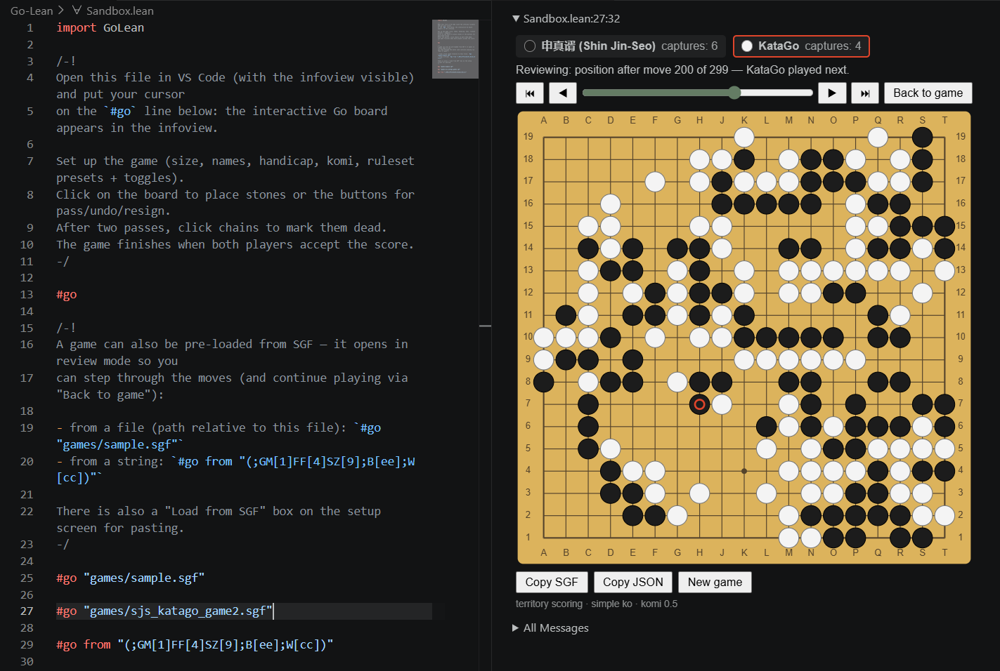

# Go-Lean

The game of Go/Baduk/Weiqi in Lean 4, with an interactive board in the infoview.



## Build & test

```sh
lake build         # library (core + protocol + widget)
lake build Tests   # run tests
```

## Play

Open [Sandbox.lean](Sandbox.lean), or write `import GoLean` + `#go` in any
file, and put the cursor on the `#go` line. 

A game can also be pre-loaded from SGF (Smart Game Format):

- `#go "games/sample.sgf"`, from a file (path relative to the current file)
- `#go from "(;GM[1]FF[4]SZ[9];B[ee];W[cc])"`, from an SGF term as a `String`
- `#go`, and paste an SGF into the **Load from SGF** box on the setup screen

The board appears in the infoview with three phases:

1. **Setup:**
    * Board Size
    * Player names
    * Handicap
    * Komi
    * Set rules by:
      * Presets (Japanese, Chinese, Tromp–Taylor, AGA)
      * Individual toggles (ko/superko, self-capture, territory/area scoring)
2. **Play:**
    * Click on the board to place stones or the buttons for pass, undo, resign
    * Captures, move number and last-move are displayed
    * Illegal moves (occupied, ko, superko, self-capture) give a warning message
3. **Scoring:** 
    * Click chains to mark them dead/alive
    * Live score card is displayed
    * Both players accept (or resume play on a dispute)
    * The final score and winner are displayed

In any phase, 
- **Review moves** switches to a read-only replay of the game, which
  can be navigated with the ⏮ ◀ ▶ ⏭ buttons or the slider. Click
  **Back to game** to return to the live game.
- **Copy SGF** exports the game so far in Smart Game Format (SGF) 
  (paste it into a `.sgf` file to open it in any Go program)
- **Copy JSON** exports the raw game record so far

## Architecture

- `GoLean/Core/` contains the core engine with the rules
  (`Game.step : Game → Action → Except IllegalAction Game`). 
  The generic flood fill algorithm, `Board.region`, works for
  chains, captures and territory.
- `GoLean/Core/Sgf.lean` converts a game to SGF FF[4] (Smart Game Format File Format 4)
- `GoLean/Core/SgfParse.lean` parses SGF back into a game (`Sgf.load`).
  This is validated by replaying every move through the rules engine.
  It is also forgiving in certain cases (HA with no
  AB, ko rules laxer than the engine's), with each case reported as a warning.
- `GoLean/Protocol.lean` contains JSON DTOs. The wire state held by the client is
  the event log, which is rebuilt server-side by folding `step`.
- `GoLean/Widget.lean` & `GoLean/widget/goBoard.js` contain one RPC method and a
  plain-JS React component (no npm build step). The JS renders the view and reports clicks.

`OldGoLean/` is the previous prototype, kept for reference. It is not part
of the build.